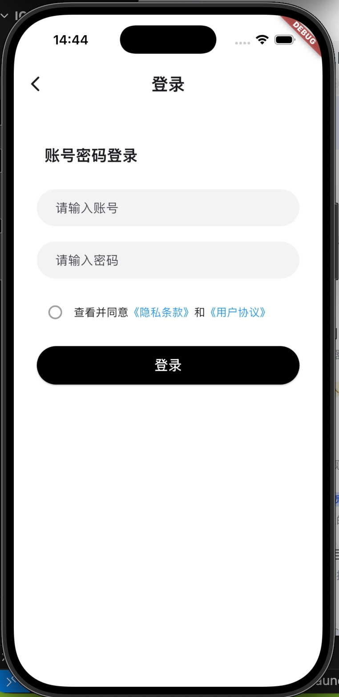

# flutter_shop_app

一个基于 Flutter 的移动端购物 App 练手项目，使用 GetX 做状态管理与路由，Dio 处理网络请求。

## 截图

| 首页 | 商品列表 | 我的 | 登录 |
|:---:|:---:|:---:|:---:|
|  |  |  |  |

## 功能

- **首页**：轮播图、商品分类入口、特惠推荐、爆款推荐、下拉刷新、上拉加载更多
- **分类**：商品分类浏览
- **购物车**：商品管理
- **我的**：会员信息、订单入口（待付款/待发货/待收货/待评价）、收藏与足迹、猜你喜欢
- **登录**：账号密码登录，本地持久化登录态

## 技术栈

| 类别 | 选型 |
|------|------|
| 框架 | Flutter (Dart `^3.11.4`) |
| 状态管理 / 路由 | [GetX](https://pub.dev/packages/get) |
| 网络请求 | [Dio](https://pub.dev/packages/dio) |
| 本地存储 | [shared_preferences](https://pub.dev/packages/shared_preferences) |
| 轮播组件 | [carousel_slider](https://pub.dev/packages/carousel_slider) |

## 目录结构

```
lib/
├── api/            # 接口定义
├── assets/         # 图片等资源
├── components/     # 公共组件
├── constants/      # 常量
├── pages/          # 页面
│   ├── Home/
│   ├── Category/
│   ├── Cart/
│   ├── Mine/
│   ├── Main/       # 主页（底部 Tab 容器）
│   └── Login/
├── routes/         # 路由配置
├── stores/         # GetX Controller / 全局状态
├── utils/          # 工具函数
├── viewmodels/     # 视图模型
└── main.dart
```

## 快速开始

### 环境要求

- Flutter SDK `^3.11.4`
- Dart `^3.11.4`
- Android Studio / Xcode（按需）

### 运行

```bash
# 克隆项目
git clone https://github.com/leleares/flutter_shop_app.git
cd flutter_shop_app

# 安装依赖
flutter pub get

# 启动（指定设备）
flutter run -d <device-id>
```

查看可用设备：

```bash
flutter devices
```

### 打包

```bash
# Android Debug 包
flutter build apk --debug

# Android Release 包
flutter build apk --release
```

## 测试账号

| 账号 | 密码 |
|------|------|
| `13200000001` ~ `13200000010` | `123456` |

## 笔记

开发过程中的 Flutter 知识点整理见 [note.md](./note.md)。

## License

MIT
